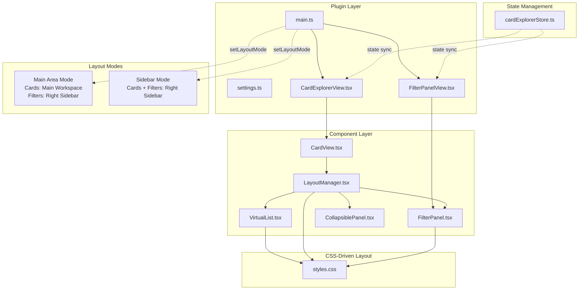
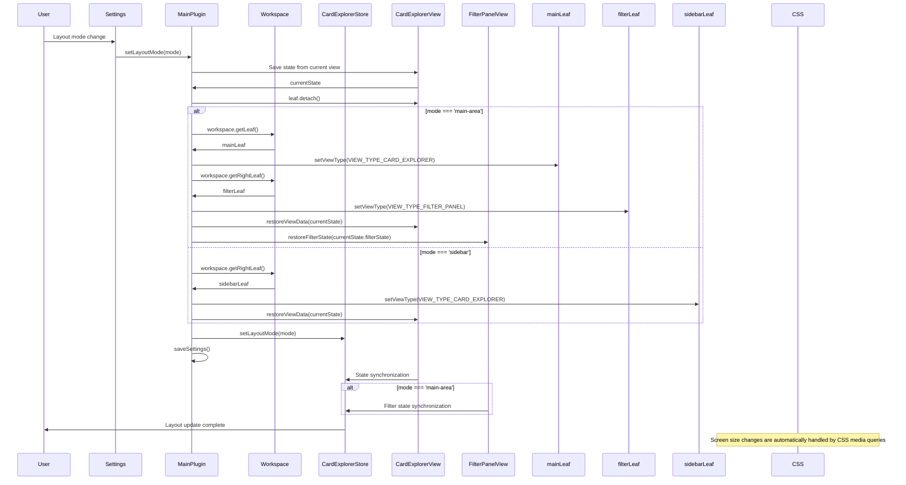

# Technical Design Document

## Overview
The responsive-card-layout feature introduces responsive design to the Card Explorer plugin through a simple approach centered on CSS Grid. It leverages standard CSS features (CSS Grid, media queries) while minimizing JavaScript to focus on settings management and layout mode switching. It achieves efficient responsive layout through native CSS power while maintaining react-virtuoso virtual scroll performance.

## Architecture



## Technology Stack

### Frontend
- **UI Library**: React 18.2.0 (functional components, hooks)
- **State Management**: Zustand 4.4.7 (existing store extension only)
- **Virtual Scrolling**: react-virtuoso 4.6.2 (CSS Grid custom component support)
- **Responsive Layout**: CSS Grid + media queries (minimal JavaScript)
- **Utilities**: Minimal (settings management only)

### CSS-Centered Approach
- **Responsive**: CSS Grid `repeat(auto-fit, minmax())` pattern
- **Breakpoints**: Standard media queries
- **Layout Switching**: Control via CSS class switching

### TypeScript Type System
- **Minimal New Types**: LayoutMode, ResponsiveConfig only
- **Existing Type Extensions**: CardExplorerSettings extension only

### Testing
- **CSS Grid Operation**: No additional testing needed as it's browser standard functionality
- **Component Testing**: Layout mode switching only
- **Settings Testing**: Persistence and validation

## Components and Interfaces

### Simple New Components

#### LayoutManager.tsx (Minimal)
```typescript
interface LayoutManagerProps {
  mode: LayoutMode;
  children: React.ReactNode;
  filterPanel: React.ReactNode;
}

type LayoutMode = 'main-area' | 'sidebar';
```

#### CollapsiblePanel.tsx (Minimal)
```typescript
interface CollapsiblePanelProps {
  title: string;
  isCollapsed: boolean;
  onToggle: () => void;
  children: React.ReactNode;
  showSummary?: boolean;
  summary?: React.ReactNode;
}
```

### Extended Components

#### main.ts (Workspace Control Addition)
- View movement control through layout mode switching
- Proper use of `workspace.getLeaf()` and `workspace.getRightLeaf()`
- State preservation and data synchronization during view movement
- Workspace relocation on settings changes

#### CardExplorerView.tsx (Renamed from view.tsx)
- **File Rename**: `view.tsx` → `CardExplorerView.tsx`
- LayoutManager integration (placement control within same area only)
- Existing error boundaries remain unchanged
- State preservation during workspace movement

#### CardView.tsx (Minimal Changes)
- LayoutManager integration (placement control within same area only)
- Existing error boundaries remain unchanged
- State preservation during workspace movement

#### FilterPanel.tsx (Minimal Changes)
- CollapsiblePanel wrapper addition (sidebar mode only)
- Existing filter logic remains unchanged

#### VirtualList.tsx (react-virtuoso List Customization)
```typescript
// Custom list component for CSS Grid layout
const GridList = React.forwardRef<HTMLDivElement>((props, ref) => (
  <div
    ref={ref}
    {...props}
    className="responsive-card-grid"
  />
));

// Used in Virtuoso component
<Virtuoso
  components={{
    List: GridList
  }}
  data={notes}
  itemContent={renderCard}
/>
```

## Responsive System with Single styles.css

### Structure within styles.css
```css
/* ==============================================
   RESPONSIVE CARD LAYOUT 
   ============================================== */

/* Base responsive grid */
.responsive-card-grid {
  display: grid;
  grid-template-columns: repeat(auto-fit, minmax(250px, 1fr));
  gap: 16px;
  padding: 16px;
  width: 100%;
}

/* Responsive breakpoints */
@media (min-width: 1200px) {
  .responsive-card-grid {
    grid-template-columns: repeat(5, 1fr);
  }
}

@media (max-width: 1199px) and (min-width: 768px) {
  .responsive-card-grid {
    grid-template-columns: repeat(auto-fit, minmax(220px, 1fr));
    gap: 14px;
  }
}

@media (max-width: 767px) {
  .responsive-card-grid {
    grid-template-columns: repeat(auto-fit, minmax(200px, 1fr));
    gap: 12px;
    padding: 12px;
  }
}

/* Layout modes */
.layout-main-area .card-explorer-container {
  display: flex;
  height: 100%;
}

.layout-main-area .main-content {
  flex: 1;
  overflow: hidden;
}

.layout-sidebar .card-explorer-container {
  display: flex;
  flex-direction: column;
  height: 100%;
  max-width: 400px;
}

.layout-sidebar .filter-panel {
  flex-shrink: 0;
}

.layout-sidebar .main-content {
  flex: 1;
  overflow: hidden;
}

/* Collapsible panel */
.collapsible-panel.collapsed .panel-content {
  display: none;
}

.collapsible-panel-header {
  cursor: pointer;
  display: flex;
  align-items: center;
  justify-content: space-between;
}

.collapsible-panel-toggle {
  transition: transform 0.2s ease;
}

.collapsible-panel.collapsed .collapsible-panel-toggle {
  transform: rotate(-90deg);
}
```

## Data Flow (Workspace Integration)



## Data Model (Simplified)

### Minimal New Type Definitions

#### Layout-Related Types
```typescript
type LayoutMode = 'main-area' | 'sidebar';

interface ResponsiveConfig {
  minCardWidth: number;    // Minimum value for CSS minmax()
  gridGap: number;         // Grid gap
}
```

#### Extended Settings Type
```typescript
interface CardExplorerSettings {
  // Existing fields
  sortKey: string;
  autoStart: boolean;
  showInSidebar: boolean;
  
  // New fields (minimal)
  layoutMode: LayoutMode;
  filterPanelCollapsed: boolean;
  responsiveConfig: ResponsiveConfig;
}
```

### Store Extension (Minimal)

#### Existing Store Extension
```typescript
// Add to cardExplorerStore.ts
interface LayoutState {
  mode: LayoutMode;
  filterPanelCollapsed: boolean;
}

interface LayoutActions {
  setLayoutMode: (mode: LayoutMode) => void;
  toggleFilterPanel: () => void;
}

// Integrate into existing cardExplorerStore
const useCardExplorerStore = create<
  CardExplorerState & LayoutState & 
  CardExplorerActions & LayoutActions
>((set, get) => ({
  // Existing state and actions...
  
  // Layout-related additions
  mode: 'main-area',
  filterPanelCollapsed: false,
  
  setLayoutMode: (mode) => set({ mode }),
  toggleFilterPanel: () => set((state) => ({ 
    filterPanelCollapsed: !state.filterPanelCollapsed 
  })),
}));
```

### Workspace Integration

#### Workspace Control in main.ts
```typescript
// Method to add to main.ts
async setLayoutMode(mode: LayoutMode): Promise<void> {
  try {
    // Save current view state
    const currentView = this.app.workspace.getActiveViewOfType(CardExplorerView);
    const currentState = currentView?.getViewData();
    
    // Close current view
    if (currentView) {
      currentView.leaf.detach();
    }
    
    // For main-area mode, separate placement of card view and filter panel
    if (mode === 'main-area') {
      // Place card view in main area
      const mainLeaf = this.app.workspace.getLeaf(false);
      await mainLeaf.setViewType(VIEW_TYPE_CARD_EXPLORER);
      
      // Place filter panel independently in right sidebar
      const filterLeaf = this.app.workspace.getRightLeaf(false);
      await filterLeaf.setViewType(VIEW_TYPE_FILTER_PANEL);
      
      // Restore state for both views
      const cardView = mainLeaf.view as CardExplorerView;
      const filterView = filterLeaf.view as FilterPanelView;
      if (currentState) {
        cardView.restoreViewData(currentState);
        filterView.restoreFilterState(currentState.filterState);
      }
    } else {
      // For sidebar mode, place integrated view in right sidebar
      const targetLeaf = this.app.workspace.getRightLeaf(false);
      await targetLeaf.setViewType(VIEW_TYPE_CARD_EXPLORER);
      const newView = targetLeaf.view as CardExplorerView;
      if (currentState) {
        newView.restoreViewData(currentState);
      }
    }
    
    // Update store state
    useCardExplorerStore.getState().setLayoutMode(mode);
    
    // Persist settings
    await this.saveSettings();
    
  } catch (error) {
    console.error('Failed to switch layout mode:', error);
    // Revert to previous state on error
    throw error;
  }
}

// View data save/restore interface
interface ViewData {
  scrollPosition: number;
  selectedFilters: FilterState;
  sortConfig: SortConfig;
  filterState: FilterState; // Independent filter state for main-area mode
}

// New view type constant for main-area mode
const VIEW_TYPE_FILTER_PANEL = 'card-explorer-filter-panel';

// Dedicated filter panel view class
class FilterPanelView extends ItemView {
  getViewType(): string {
    return VIEW_TYPE_FILTER_PANEL;
  }
  
  getDisplayText(): string {
    return 'Card Explorer Filters';
  }
  
  restoreFilterState(filterState: FilterState): void {
    // Filter state restoration logic
  }
}
```

## Error Handling (Simplified)

### Minimal Error Handling
```typescript
// Handle only layout mode switching failures
enum LayoutErrorType {
  LAYOUT_MODE_SWITCH_FAILED = 'LAYOUT_MODE_SWITCH_FAILED',
  WORKSPACE_LEAF_CREATION_FAILED = 'WORKSPACE_LEAF_CREATION_FAILED',
  VIEW_STATE_RESTORATION_FAILED = 'VIEW_STATE_RESTORATION_FAILED',
  SETTINGS_SAVE_FAILED = 'SETTINGS_SAVE_FAILED'
}
```

### Error Recovery Strategy
1. **Workspace leaf creation failure**: Retry at fallback location
2. **View state restoration failure**: Open view with default state
3. **Layout mode switching failure**: Restore to previous mode and notify user
4. **Settings save failure**: Continue with default settings, notify user
5. **CSS Grid related**: Browser handles automatically, no additional handling needed

## Security Considerations (Simplified)

### Input Validation
- Enum check for layout mode values
- Range validation for ResponsiveConfig values

### Memory Safety
- Inherit existing VirtualList cleanup
- No additional memory leak prevention needed as it's CSS-only

## Performance and Scalability (CSS-Centered)

### CSS Grid Advantages
- **Native Performance**: Browser engine level optimization
- **No JavaScript Overhead**: No resize processing needed
- **Automatic Layout**: `auto-fit` automatically calculates optimal column count
- **Hardware Optimization**: GPU acceleration support

### Integration with react-virtuoso
```typescript
// Minimal performance optimization
const GridList = React.forwardRef<HTMLDivElement>((props, ref) => (
  <div
    ref={ref}
    {...props}
    className="responsive-card-grid"
    style={{
      // CSS Grid settings delegated to CSS file
      // No dynamic JavaScript calculations needed
    }}
  />
));
```

### Memory Efficiency
- Automatic layout via CSS Grid (reduced JS memory usage)
- Inherit existing react-virtuoso performance characteristics
- Minimize additional React components

## Testing Strategy (Simplified)

### Minimal Required Testing

#### Component Testing
```typescript
// LayoutManager.test.tsx
describe('LayoutManager', () => {
  it('should apply correct CSS class for layout mode', () => {
    render(<LayoutManager mode="main-area" />);
    expect(screen.getByTestId('layout-container')).toHaveClass('layout-main-area');
  });
  
  it('should switch layout modes', async () => {
    const { rerender } = render(<LayoutManager mode="main-area" />);
    rerender(<LayoutManager mode="sidebar" />);
    expect(screen.getByTestId('layout-container')).toHaveClass('layout-sidebar');
  });
});

// CollapsiblePanel.test.tsx
describe('CollapsiblePanel', () => {
  it('should toggle collapsed state', () => {
    const mockToggle = vi.fn();
    render(
      <CollapsiblePanel isCollapsed={false} onToggle={mockToggle} title="Test">
        Content
      </CollapsiblePanel>
    );
    
    fireEvent.click(screen.getByRole('button', { name: /toggle/i }));
    expect(mockToggle).toHaveBeenCalled();
  });
});
```

#### Settings Testing
```typescript
// Settings.test.tsx
describe('Layout Settings', () => {
  it('should save and load layout preferences', async () => {
    const settings = { layoutMode: 'sidebar', filterPanelCollapsed: true };
    await saveSettings(settings);
    const loaded = await loadSettings();
    expect(loaded.layoutMode).toBe('sidebar');
  });
});
```

### CSS Grid Testing
CSS Grid operation is browser standard functionality, so specific grid calculation tests are unnecessary. CSS class application verification is sufficient.

### E2E Test Scope (Minimal)
- Basic layout mode switching functionality
- Filter panel collapse functionality
- Settings persistence

## Key Implementation Points

### 1. Leverage CSS Grid Power
- Avoid dynamic JavaScript calculations, delegate to CSS `auto-fit` and `minmax()`
- Automatic responsive handling via media queries

### 2. Harmony with Existing Architecture
- Minimize new components
- Extend existing Zustand store
- Maintain react-virtuoso integration

### 3. Performance Priority
- Leverage browser native optimization
- Minimize JavaScript overhead
- Preserve virtual scroll performance